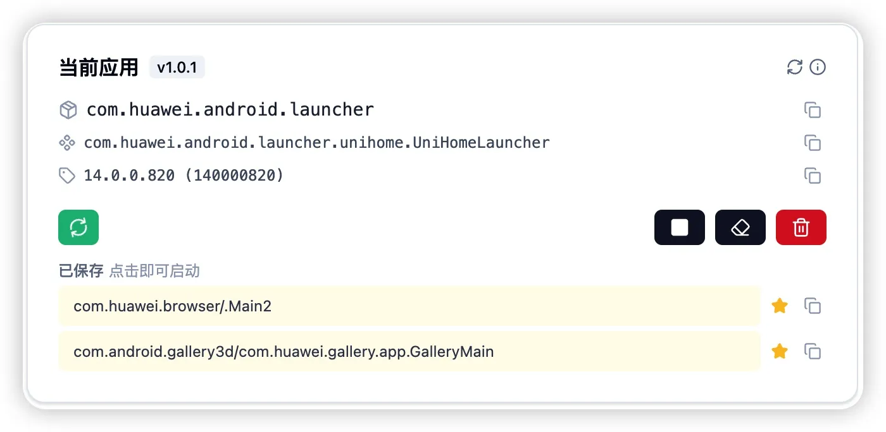

# Current App

A [uiauto.dev](https://github.com/nicepkg/uiautodev) plugin: gets the package name of the current foreground app, with support for launching, force-stopping, and uninstalling it. [中文](./README.zh-CN.md)

## Features

- **Auto refresh**: Detects the foreground app package name automatically once opened, silently polls every 3 seconds, and updates when the app changes
- **Launch entry list**: Parses all MAIN/LAUNCHER entries of the app via `cmd package query-activities` (some apps have several); click to launch
- **Force stop**: Runs `am force-stop` to stop the current app
- **Uninstall**: Runs `pm uninstall` after a confirmation prompt
- **Manual refresh toggle**: Refresh button for manual refresh anytime; turn auto refresh on/off

## Screenshot



## Usage

1. Put the plugin directory into `~/.config/uiautodev/plugins/`
2. Install dependencies and build:

```bash
npm install
npm run build
```

3. Open the plugin in uiauto.dev, keep an app in the foreground on the device, and the plugin shows its package name.

## Project Structure

```
├── plugin.json          # Plugin metadata (name, version, description)
├── app.tsx              # Plugin logic entry
├── app.js               # Compiled output (loaded by index.html)
├── app.css              # Tailwind compiled output (loaded by index.html)
├── styles.css           # Tailwind source entry
├── index.html           # Plugin UI entry
└── plugin-runtime.d.ts  # Platform API type definitions
```

## Development Commands

```bash
npm run dev          # Dev mode, watches app.tsx and styles, auto-compiles
npm run build        # Compile Tailwind into app.css and bundle app.tsx into app.js
npm run fetch-types  # Fetch the latest type definitions (requires uiauto.dev running)
```

## License

[MIT](./LICENSE)

## Tech Stack

- **Preact** — lightweight UI framework
- **lucide-preact** — icons
- **TypeScript** — type safety
- **Tailwind CSS** — build-time precompilation (`darkMode: 'class'`, follows `<html class="dark">`)
- **esbuild** — fast bundling
